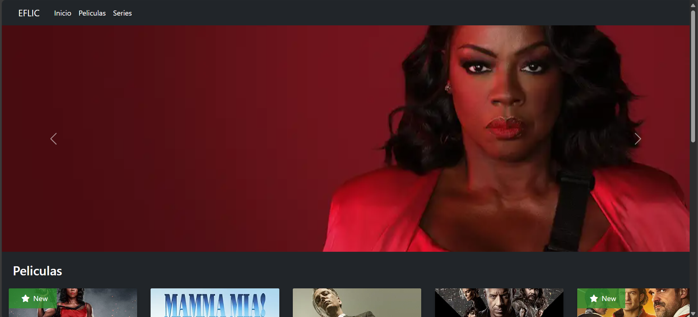
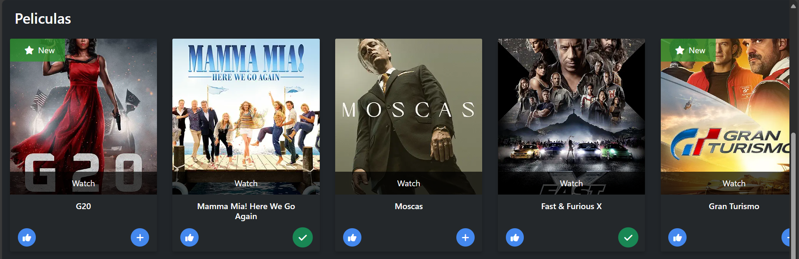
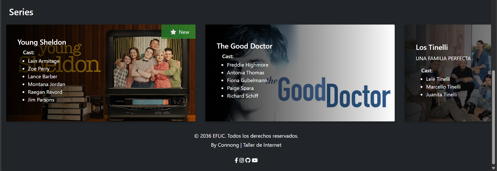
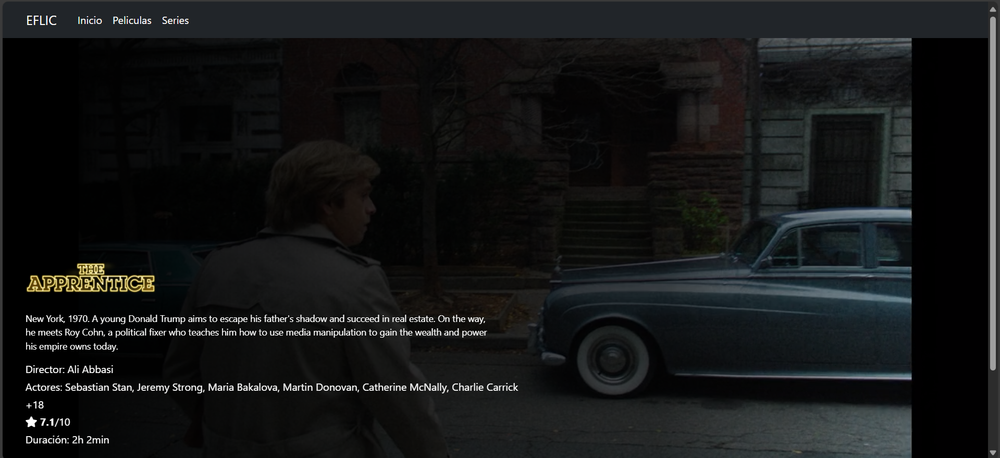

# 🎬 Eflic

**Eflic** es un clon de Netflix hecho con HTML, CSS y Bootstrap. Está diseñado como un proyecto educativo y cuenta con un diseño moderno, responsive y una navegación simple.

---

## 🖼️ Vista previa

### Página principal (index.html)

### Página de película (index.html)

### Página de Series (index.html)

### Página bonus (movie.html)

---

## 🧰 Tecnologías utilizadas

- ✅ HTML5
- ✅ CSS3
- ✅ [Bootstrap 5](https://getbootstrap.com/)

